[English](README.en.md) | **简体中文**

<picture>
  <source media="(max-width: 640px) and (prefers-color-scheme: dark)" srcset="assets/presentation/hero-mobile-dark.svg">
  <source media="(max-width: 640px)" srcset="assets/presentation/hero-mobile-light.svg">
  <source media="(prefers-color-scheme: dark)" srcset="assets/presentation/hero-dark.svg">
  
</picture>

**repick 把编码 Agent 的导出 trace 整理成按任务对齐的 A/B 表，让你看清工具选择与任务结果之间的差别。**

`v0.1.0` · `Bun ≥ 1.1` · `TypeScript` · [MIT](LICENSE)

[为什么](#为什么做-repick) · [架构](#架构) · [安装](#安装) · [快速开始](#快速开始) · [使用](#使用) · [Demo](#demo) · [接入与配置](#接入与配置) · [路线图](#路线图)

## 为什么做 repick

换了一组工具以后，整次任务的成功与否还不足以解释变化。你可能更想知道：同一个子任务，两次运行分别先选了什么工具，最后是否解决、花了多长时间，中间有没有重试或转用其他工具。

repick 从已经导出的 trace 中提取这些记录，再把同名任务放到一起。先检查任务结果，再比较记录的耗时，最后回到逐任务差异核对。报告供你继续调查，下一次运行的工具设置由你决定。

下面用仓库自带的两份合成 trace 展示这条路径。图中耗时和后文的 token 数都来自输入字段，不是本次执行测得的 Agent 性能，也不能用来证明某个工具普遍更好。

<picture>
  <source media="(max-width: 640px) and (prefers-color-scheme: dark)" srcset="assets/presentation/process-mobile-dark.svg">
  <source media="(max-width: 640px)" srcset="assets/presentation/process-mobile-light.svg">
  <source media="(prefers-color-scheme: dark)" srcset="assets/presentation/process-dark.svg">
  
</picture>

## 架构

<picture>
  <source media="(max-width: 640px) and (prefers-color-scheme: dark)" srcset="assets/presentation/architecture-mobile-dark.svg">
  <source media="(max-width: 640px)" srcset="assets/presentation/architecture-mobile-light.svg">
  <source media="(prefers-color-scheme: dark)" srcset="assets/presentation/architecture-dark.svg">
  
</picture>

两个导入 adapter 将不同字段整理成同一个 `ToolDecision`：任务标识、所选工具、可选工具，以及带有解决状态、耗时、token、重试和 fallback 的结果。CLI 把每次运行写入本地 JSONL 文件，比较引擎再读取两份记录、按 `task_sig` 配对，输出 Markdown 表格。

对应源码位于 [导入层](src/ingest/)、[数据模型](src/ingest/schema.ts)、[本地 ledger](src/ledger/store.ts) 和 [A/B 引擎](src/replay/ab.ts)。`task_sig` 只规范化文本的大小写、空白和标点，不会识别不同措辞是否表达同一个任务。

## 安装

需要 Bun 1.1 或更新版本；先用 `bun --version` 检查当前环境。

```bash
git clone https://github.com/SuperMarioYL/repick.git
cd repick
bun install
```

在源码目录中使用 `bun src/cli.ts`。下面的离线示例不启动 Agent、不调用模型 API；安装依赖时需要网络。

## 快速开始

在刚克隆的项目中，导入 [Claude 格式示例](examples/claude-code-trace.jsonl) 和 [Codex 格式示例](examples/codex-trace.jsonl)，然后生成比较表：

```bash
bun src/cli.ts record run-A --agent claude --trace examples/claude-code-trace.jsonl
bun src/cli.ts record run-B --agent codex --trace examples/codex-trace.jsonl
bun src/cli.ts ab run-A run-B
```

两份输入各包含 3 条决策，任务描述能够一一配对。输出会包含：

```text
Losing tool: grep (run-A) — block grep (lost 3 tasks)
```

`block grep` 是报告里的建议文字，当前版本不会据此禁用工具。`record` 会自动建立 ledger，因此不必先执行 `init`。同一 run ID 会追加记录；重复试验时请换用新的 run ID，以免把两次导入合在一起。

## 使用

```bash
# 查看已导入的 run ID
bun src/cli.ts list

# 展开每个匹配任务的差异
bun src/cli.ts ab run-A run-B --verbose
```

`record` 的 `--agent` 选择导入格式，支持 `claude` / `claude-code` 和 `codex`；`--trace` 指向 JSONL 文件，传入 `-` 时读取标准输入。`init` 可选，只负责建立本地目录。v0.1.0 的主要操作是 `record`、`ab` 和 `list`。

## Demo

同一次本地运行生成了下面的工具汇总表。每一行按“run + 任务中首先出现的工具”分组，`picks` 是该组的任务数；如果任务有多个步骤，耗时和 token 会先在任务内累加。

| tool | run | picks | resolved | avg-secs | tokens | verdict | retune hint |
| --- | --- | --- | --- | --- | --- | --- | --- |
| grep | run-A | 3 | 2 | 24.3 | 3320 | loser | block grep (lost 3 tasks) |
| lsp-symbol | run-B | 2 | 2 | 7.5 | 840 | winner | — |
| ripgrep | run-B | 1 | 1 | 7 | 360 | winner | — |

追加 `--verbose` 后，可以核对汇总结论来自哪些任务：

| task_sig | baseline | candidate | Δsecs | Δresolved | verdict | retune hint |
| --- | --- | --- | --- | --- | --- | --- |
| find-dead-code | grep | ripgrep | -24 | +1 | candidate-wins | block grep on find-dead-code |
| refactor-auth-module | grep | lsp-symbol | -15 | 0 | candidate-wins | block grep on refactor-auth-module |
| rename-symbol-everywhere | grep | lsp-symbol | -12 | 0 | candidate-wins | block grep on rename-symbol-everywhere |

[完整命令与输出](docs/demo-results.json) · [可重放命令脚本](docs/demo.sh) · [文本记录](docs/demo-output.txt)

### 比较规则

1. 只给两次运行中都存在的 `task_sig` 生成逐任务判定；未匹配任务仍可能出现在各自的工具汇总中。
2. 一个任务含多个步骤时，使用输入顺序中的第一条决策代表工具选择；任一步骤解决即视为任务解决，耗时与 token 累加。
3. 只有一侧解决时，该侧胜出；两侧都解决时比较耗时，差距不超过较大耗时的 5% 视为平局；两侧都未解决时为 `inconclusive`。
4. 按每个工具的任务胜负数生成汇总判定。输出适合定位值得复查的选择，不会把相关性变成工具效果的因果结论。

## 能力与职责

<picture>
  <source media="(max-width: 640px) and (prefers-color-scheme: dark)" srcset="assets/presentation/integrations-mobile-dark.svg">
  <source media="(max-width: 640px)" srcset="assets/presentation/integrations-mobile-light.svg">
  <source media="(prefers-color-scheme: dark)" srcset="assets/presentation/integrations-dark.svg">
  
</picture>

| 环节 | v0.1.0 的职责 | 需要你提供的内容 |
|---|---|---|
| Trace 导入 | 读取两种示例定义的 JSONL 格式，验证并规范化字段 | 按相应 schema 导出的工具事件和结果 |
| 记录保存 | 在 `.repick/<runId>.jsonl` 追加 `ToolDecision` | 能区分各次实验的 run ID |
| A/B 比较 | 匹配任务、聚合结果、生成工具表及逐任务差异 | 可比较的任务描述与一致的指标口径 |
| 采取行动 | 输出 `retune hint` 文字 | 人工判断并在外部调整工具设置 |

这些 adapter 对应本项目定义的导出格式，不是对 Agent 的实时连接，也不保证任意原生历史日志都能直接导入。`retune` 和 `gate` 目前只输出路线图提示。

## 接入与配置

当前版本不需要配置文件或 API key。状态位置取决于执行命令时的工作目录，导入和比较时应在同一个项目目录中操作。先对照示例准备每行一个 JSON 对象的输入：

| 含义 | Claude 格式 | Codex 格式 | 规范化后 |
|---|---|---|---|
| 任务 | `task` | `intent` | `task_sig` |
| 步骤 | `step` | `seq` | `step_idx` |
| 工具 | `tool` | `name` | `tool` |
| 参数摘要 | `args` | `summary` | `arg_summary` |
| 可选工具 | `available` | `tools` | `available_tools` |
| 是否解决 | `resolved` | `ok` | `outcome.resolved` |
| 耗时 | `secs` | `duration_ms` | 秒，后者除以 1000 |
| Token | `tokens` | `tokens_in` | `outcome.tokens` |

`retried` 和可选 `fallback` 也会保留。采集方需要统一统计口径，尤其是 `tokens` 与 `tokens_in` 的含义；repick 做字段映射，不校准不同来源的计量语义。两个任务描述只有经过文本规范化后相同，才会被配对。

开发时可运行 `bun test` 和 `bun run typecheck`。输入契约见 [schema](src/ingest/schema.ts)，判定逻辑见 [A/B 引擎](src/replay/ab.ts)。

## 路线图

| 状态 | 范围 |
|---|---|
| 已实现 · m1 | 两种导出格式、JSONL ledger、按任务 A/B 比较、工具汇总和逐任务差异 |
| 计划 · m2 | 根据报告生成 `ToolAvailabilityConfig`，通过按需启动的 MCP gate 执行工具可用性设置 |
| 探索 · m3 | Cursor 导入、跨措辞任务对齐，以及 dashboard 导出 |

当前版本不含托管 dashboard、实时 Agent 包装、自动改写提示词或学习式工具选择策略。

## 许可证

[MIT](LICENSE) © 2026 SuperMarioYL · [源码与问题反馈](https://github.com/SuperMarioYL/repick)
