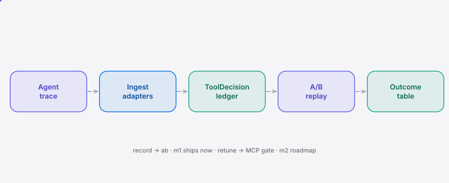

<div align="right"><sub><a href="./README.md">English</a>&nbsp;&nbsp;⇄&nbsp;&nbsp;<b>简体中文</b></sub></div>

<p align="center">
  <picture>
    <source media="(prefers-color-scheme: dark)" srcset="./assets/hero-dark.svg">
    <source media="(prefers-color-scheme: light)" srcset="./assets/hero-light.svg">
    
  </picture>
</p>

<p align="center"><sub>为开发者 A/B 对比并重调智能体工具选择的回放层。</sub></p>

<p align="center">
  <a href="./LICENSE"></a>
  
  
  
  
</p>

**repick 记录编码智能体每一次工具选择及其可观测结果，对两次运行做 A/B 对比，并交给你一个有据可依的重调旋钮 —— 不是凭感觉。**

<h2> 架构</h2>

<p align="center">
  <picture>
    <source media="(prefers-color-scheme: dark)" srcset="./assets/atlas-dark.svg">
    <source media="(prefers-color-scheme: light)" srcset="./assets/atlas-light.svg">
    
  </picture>
</p>

新的原语是 **ToolDecision** —— 从 trace 中抽离出的一个工具选择时刻，并与它的可观测结果关联，使工具选择成为一等可比的单位，而非运行中不可见的副作用。各智能体的适配器把 Claude Code 与 Codex 不同的 trace 字段命名隐藏在一个归一化形状之后；A/B 引擎按 `task_sig`（稳定的任务指纹）把两次运行的决策连接起来，逐工具对比结果。

## 目录

- [为什么需要它](#为什么需要它)
- [安装](#安装)
- [快速开始](#快速开始)
- [用法](#用法)
- [演示](#演示)
- [路线图](#路线图)
- [协议](#协议)

## 为什么需要它

编码智能体现在每个子任务都会在多个工具间做选择 —— grep、LSP、文件编辑器、浏览器 —— 但没有任何记录把每一次工具选择与该子任务的可观测结果关联起来。工程师看着自己的智能体伸手去用 grep 而忽略项目里的 LSP，怀疑这一选择不对，却没有按选择粒度的结果账本，也没有旋钮能在下一次运行里关掉 grep。repick 把工具选择变成一个可引导的流原语：观测结果、对运行做 A/B 对比、再依证据重调工具可用性。

## 安装

repick 运行在 [Bun](https://bun.sh) 1.1+ 之上。

```bash
curl -fsSL https://bun.sh/install | bash   # 如果还没装 bun
git clone https://github.com/SuperMarioYL/repick.git
cd repick && bun install
```

发布后 `bunx repick` 即可全局使用。本地克隆可用 `bun src/cli.ts` 调用（或 `bun link` 把 `repick` 放到 PATH 上）。

## 快速开始

从全新克隆到看到 A/B 表，三条命令。（`repick init` 是可选的 —— `record` 会自动建好 `.repick/` 账本。）

```bash
bun src/cli.ts record run-A --agent claude --trace examples/claude-code-trace.jsonl
bun src/cli.ts record run-B --agent codex  --trace examples/codex-trace.jsonl
bun src/cli.ts ab run-A run-B
```

<details><summary>示例输出</summary>

```
repick ab — run-A vs run-B

| tool | run | picks | resolved | avg-secs | tokens | verdict | retune hint |
| --- | --- | --- | --- | --- | --- | --- | --- |
| grep | run-A | 3 | 2 | 24.3 | 3320 | loser | block grep (lost 3 tasks) |
| lsp-symbol | run-B | 2 | 2 | 7.5 | 840 | winner | — |
| ripgrep | run-B | 1 | 1 | 7 | 360 | winner | — |

Losing tool: grep (run-A) — block grep (lost 3 tasks)
```
</details>

<h2> 用法</h2>

repick 是一个三动词界面：`record`、`ab`，以及（m2 阶段的）`retune`。每一步用户耗时都不超过一分钟。

```bash
# 建立 .repick/ 账本（可选 —— record 会按需自建）
repick init

# 把导出的智能体 trace 作为 ToolDecision 流写入账本
# --agent 选择适配器；--trace - 从标准输入读取
repick record run-A --agent claude --trace path/to/trace.jsonl
repick record run-B --agent codex  --trace path/to/trace.jsonl

# 对比两次运行；-v 附带逐任务差异
repick ab run-A run-B --verbose

# 列出账本里的运行
repick list
```

一份 trace 就是每行一个 JSON 对象。Claude Code 与 Codex 字段名不同（正是适配器要隐藏的混乱）；无论哪种，适配器都归一化为一个 `ToolDecision`。各格式样例见 `examples/`。v0.1 采集的是**导出的** trace（仅做事后回放）—— 实时包裹智能体是后续工作。

<h2> 演示</h2>

主角产物就是这张 A/B 结果表。这里把 `run-A`（Claude Code，重度依赖 grep）与 `run-B`（Codex，ripgrep + LSP）在同样三个重构任务上对比：

| tool | run | picks | resolved | avg-secs | tokens | verdict | retune hint |
| --- | --- | --- | --- | --- | --- | --- | --- |
| grep | run-A | 3 | 2 | 24.3 | 3320 | loser | block grep (lost 3 tasks) |
| lsp-symbol | run-B | 2 | 2 | 7.5 | 840 | winner | — |
| ripgrep | run-B | 1 | 1 | 7 | 360 | winner | — |

```
Losing tool: grep (run-A) — block grep (lost 3 tasks)
```

repick 标出了 grep：三个任务里智能体都先选了 grep，而先选 ripgrep + LSP 的那次运行每个任务都更快解决。这正是“grep 干赢 LSP、却没法引导”的痛点在你自己 trace 上被量化的样子。用上面的快速开始命令即可复现（可复现的 vhs 脚本见 `docs/demo.tape`）。

<h2> 路线图</h2>

- [x] **m1 —— record + A/B 表** · 适配器（Claude Code + Codex）、JSONL 账本、`task_sig` A/B 连接、能标出败方工具的命令行表格。*(本版本)*
- [ ] **m2 —— retune 回路** · `repick retune` 依 A/B 判定生成 `ToolAvailabilityConfig`，一个 MCP 门控服务（按需经 stdio 拉起，非守护进程）遵守它，使下一次运行确实无法触达被禁工具。`ab` 增加前后差异行。
- [ ] **m3 —— 跨厂商** *(延伸目标)* · Cursor 适配器、跨智能体 `task_sig` 归一化使同一任务能在 Claude Code / Codex / Cursor 间对比，以及看板导出。

v0.1 明确不做：Web UI / 托管看板、自动改写智能体提示词、学习式工具选择策略、实时在线引导、遥测上传，以及按 token 成本的建议。

<h2> 协议</h2>

MIT —— 见 [LICENSE](./LICENSE)。免费开源；无账号、无云、无付费功能。在 [github.com/SuperMarioYL/repick](https://github.com/SuperMarioYL/repick) 提 issue 或 PR；issue 模板就是“贴出你的 `repick ab` 表”。

<p align="center"><sub><a href="./LICENSE">MIT</a> © 2026 SuperMarioYL</sub></p>
